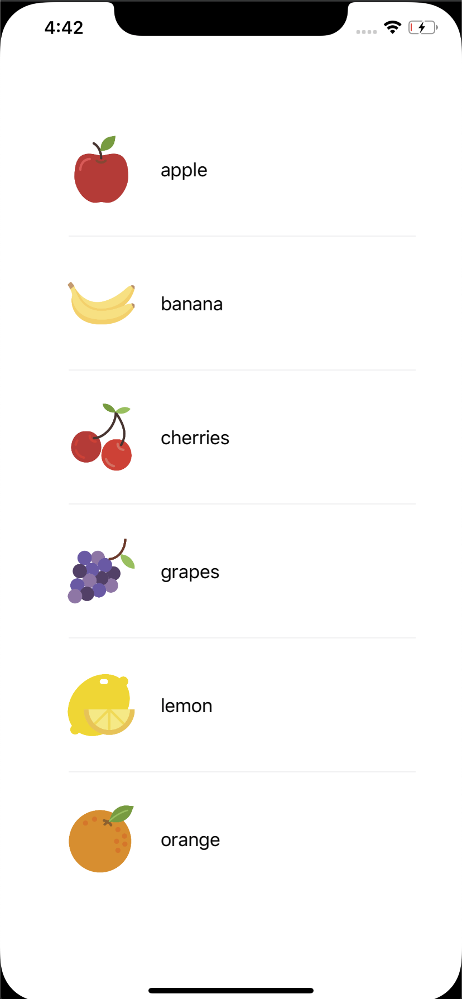
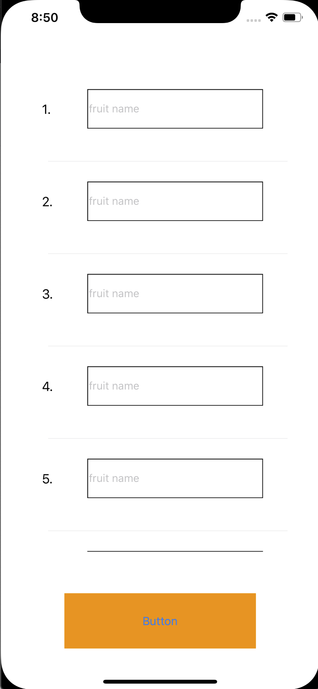
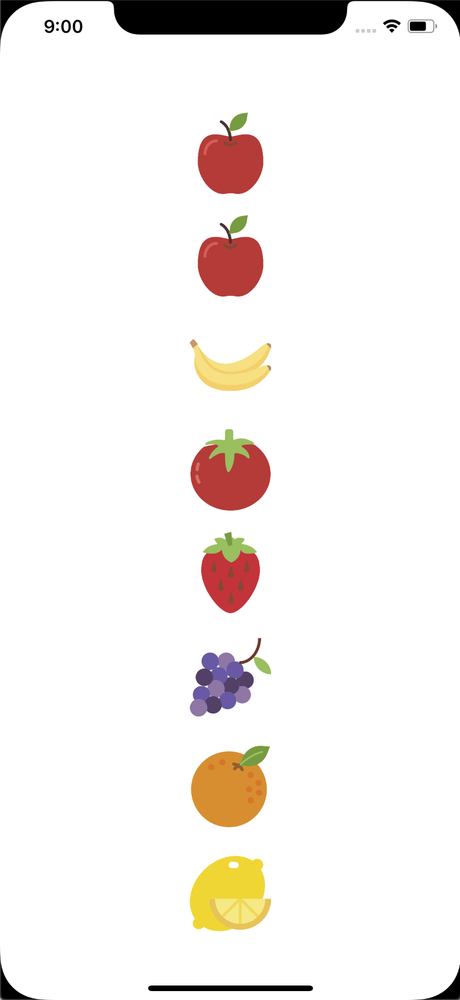
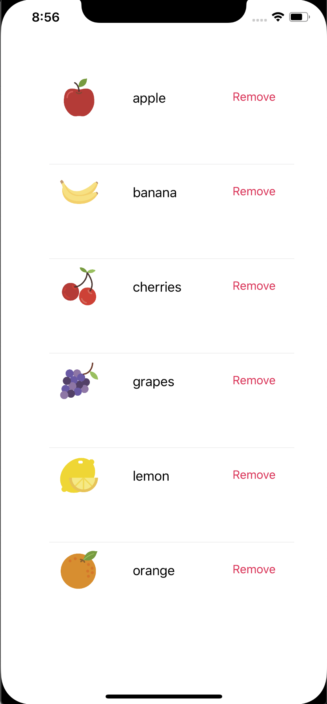

# TableView with rxSwift

Applying rxSwfit on tableview in various situations

There are several ways to develope tableview with rxSwfit.

This one is one of the way, not the answer you must follow.

- Code explaination : https://dev-wd.github.io/swift/2019-11-24-tableview-rxswift-example/

## Example 1. Showing data on tableview cell

- Showing fruit name and image on tableview.

- Data: BehaviorRelay

- Binding data on tableview with Rxswift

## Example 2. Get data from cell textfield

- Showing numberLabel and textField on tableview.

- Data: BehaviorRelay

- Binding data on tableview with Rxswift

If you type the fruit name, then you can see the images of each fruit. 

Here are the images of fruit which you typed on previous page.

## Example 3. Treat button event from tableview cell 

- Showing fruit name, image, and remove button on tableview.

- Data: BehaviorRelay

- Binding data on tableview with Rxswift

If you click 'Remove', then cell will be removed from tableview.

